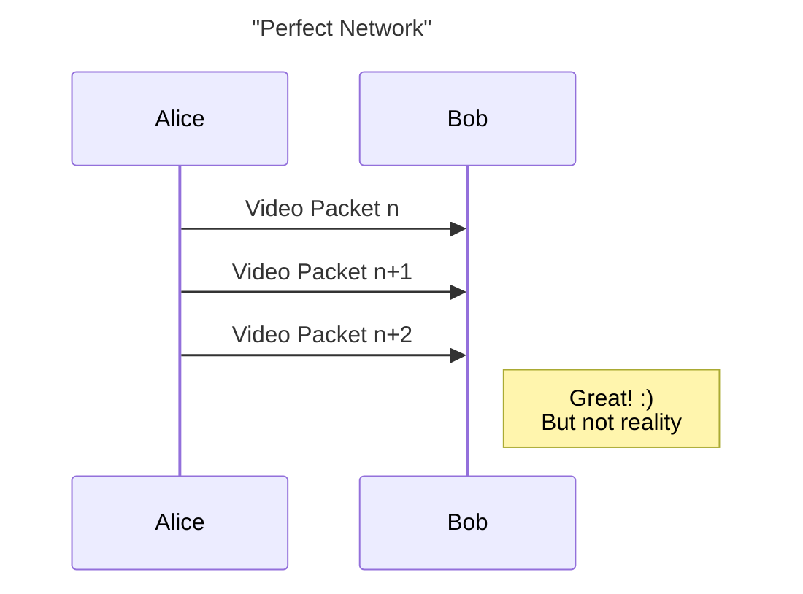
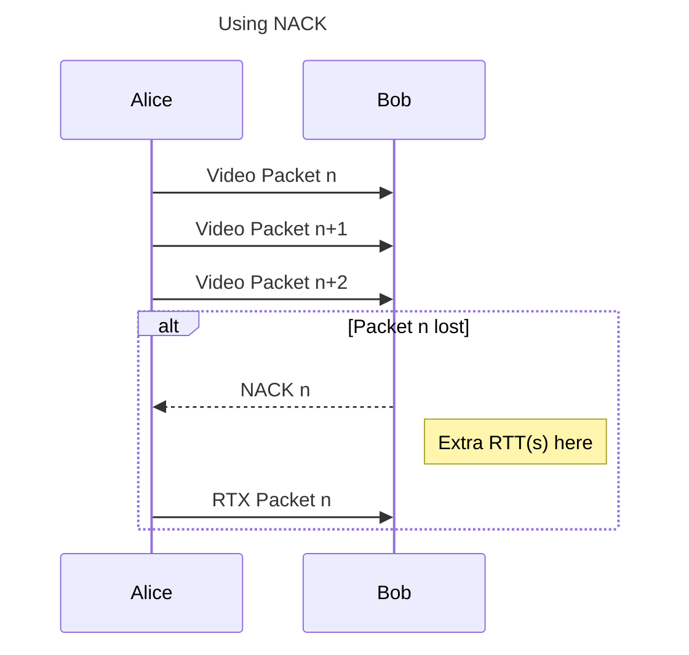
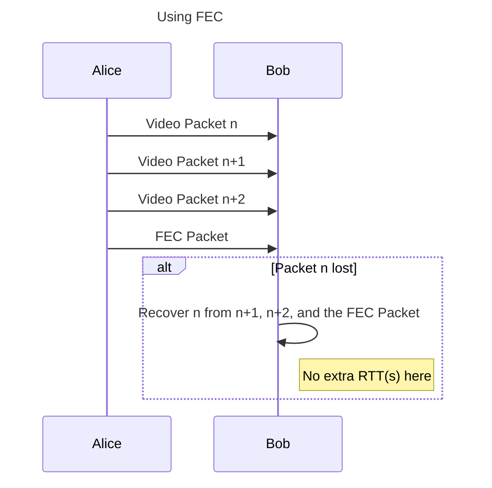

We are excited to have FEC encoding support available in the upcoming Pion v4.1.2 + pion/interceptor v0.1.38. In this blog post, you can learn about FEC and how to use it with Pion.

> If you already know FEC, feel free to skip to [FlexFEC in Pion](#flexfec-in-pion).

## Quick background: What is FEC?

Forward Error Correction (FEC) is a proactive loss-recovery mechanism that can be used to recover lost packets.

Along with each block of media packets, You intentionally transmit extra mathematically derived parity packets (e.g. xor of the media packets). If the reciver later discovers that one or even more packets are lost, it can use the parity packets to recover the lost packets, All without waiting for the lost packets to be retransmitted.

## We Already Have NACK, Why FEC?

Alice is sending a video stream to Bob with WebRTC. In an imaginary perfect network condition in which no packet loss happens and the network delay is 0 ms, all Alice needs to do is encode the video, pack RTP packets, and send them to Bob. What Bob needs to do is simply depacketize RTP packets and decode the payload into video frames. Everything is great except this imaginary perfect network condition doesn't exist.



Let's gradually introduce more factors into our network, to make it closer and closer to the real internet we live in. First, let's add packet loss while keep network delay still at 0 ms. With packet loss, not every packet Alice sends is guaranteed to be received by Bob. So we need a mechanism to recover these lost packets. A straight forward approach is to make Alice resend the lost packets again. In order to notify Alice which packet is lost and needs to be retransmitted, Bob should explicitly send message to Alice, containing the sequence number of lost packets. This is NACK. With NACK in our lossy but no-delay network, all packets can be retransmitted immediately after Bob requests NACK. Problem solved? In this case, yes. But in the real world, no.



Next, we are also adding delays to our imaginary network. At this point, it basically has all the characteristics of real world networks. Can our current mechanism tackle network delay + loss without hurting transportation quality? Sadly, no. If Alice packs a frame into 10 packets, Bob can't decode even with 1 packet being lost. And since NACK takes at least 1 additional RTT(more than 1 when retransmitted packets are lost too), this frame is delayed on Bob's side. To make things even worse, in modern video codecs, in order to increase compression ratio, encoders use a techology called **forward prediction** which means subsequent frames relies on the data of previous frame to decode. For any frame delayed due to network loss, all subsequent non-key frames will be delayed. This can cause noticeable jank for Bob, which is bad.



FEC is a mechanism that can mitigate this. FEC stands for **Forward Error Correction**. Basically, it means that we can send more data to prevent possible future losses. With FEC enabled, Alice does not only send 10 video packets to Bob, but also a few redundant packets, containing data xored from video packets. When packets get lost during transmission, Bob can try to recover it with redundant data from FEC packets. In this case, no additional RTT is needed to recover packets lost, so video streaming is not affected.

## FEC Protocols in WebRTC

In WebRTC, there are two types of FEC codecs, which have slightly different way in how they are transferred from sender to receiver. FlexFEC packets have distinct payload type and SSRC from the video track. During peer connection FlexFEC track is declared in SDP with SSRC group such as `a=ssrc-group:FEC-FR aaaaa bbbbb`, here `aaaaa` is video track SSRC, `bbbbb` is FEC track SSRC. On the other hand, UlpFEC packets are transferred under the same SSRC as the video track. This requires the ability to disinguish the packet's type from the paylod of RTP packets, which can only be done in VPX codecs since H.264 and H.265 doesn't have the entry to indicate this information. This means only FlexFEC can be used regardless of the codec. FEC works on RTP packet level, which means the unit of FEC encode/decode is RTP packet. NACK and FEC work independently, RTX packets are not included during FEC encoding/decoding, and FEC packets will not be retransmitted.

## FEC Codecs in WebRTC

Many different algorithms have been designed to generate redundant data and recover lost packets. FlexFEC and UlpFEC are based on xor with different logic in deciding who xors with who. There is also an algorithm called Reed-Soloman that can offer better recovery ability mathematically. Due to it's high complexity both in understanding and in computing, Reed-Soloman based FEC in WebRTC have not yet made it's way into any web standard or opensource implementation. There is an [implementation](https://github.com/klauspost/reedsolomon) of the SIMD accelerated Reed-Soloman algorithm in go that's fun to play with if you are interested.

## FlexFEC in Pion

We now have FlexFEC encoding support in Pion that can be used in pairs with chromium and safari, and it's easy to add to your project (register the codec in media engine and add an interceptor, then you are good to go)!

### Enable FlexFEC Encoding in Pion

Register FlexFEC codec to MediaEngine:

```go
err = m.RegisterCodec(
    webrtc.RTPCodecParameters{
        RTPCodecCapability: webrtc.RTPCodecCapability{
            MimeType:     webrtc.MimeTypeFlexFEC03,
            ClockRate:    90000,
            Channels:     0,
            SDPFmtpLine:  "repair-window=10000000",
            RTCPFeedback: nil,
        },
        PayloadType: 118, // You can change this
    },
    webrtc.RTPCodecTypeVideo,
)
```

Register FlexFEC interceptor:

```go
fecInterceptor, err := flexfec.NewFecInterceptor()
// handle error...
i.Add(fecInterceptor)
```

That's it! But with a few catches:
1. The order of the FlexFEC interceptor in the chain of interceptors matters. It should be registered before TWCC header extension interceptor and NACK responder interceptor if you are using these.
2. If you are using congestion controller, be aware of the bandwidth FEC is taking, you should set your encoder's bitrate to `cc_estimated_bandwidth - fec_bitrate`. By default, out of 5 media packets, 2 FEC packets will be produced, so you can calculate how much data encoder should output accordingly.

### Configuring FlexFEC Encoder Interceptor

There are [a few options](https://github.com/pion/interceptor/blob/master/pkg/flexfec/option.go) that you can use to tweak the encoder interceptor.

### Verify that FlexFEC is Enabled

- On sender side, which is within Pion, you can log the packets.
- On receiver side, for example in chromium, you can go to `chrome://webrtc-internals` and search for the stats graph of fecBytesReceived.

