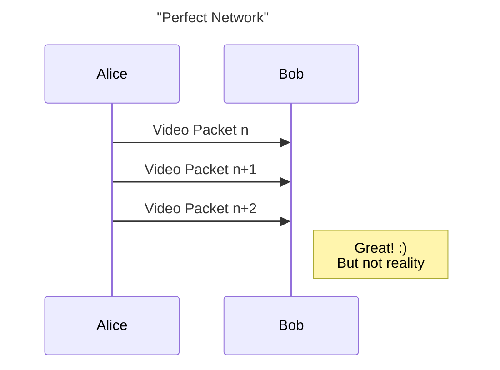
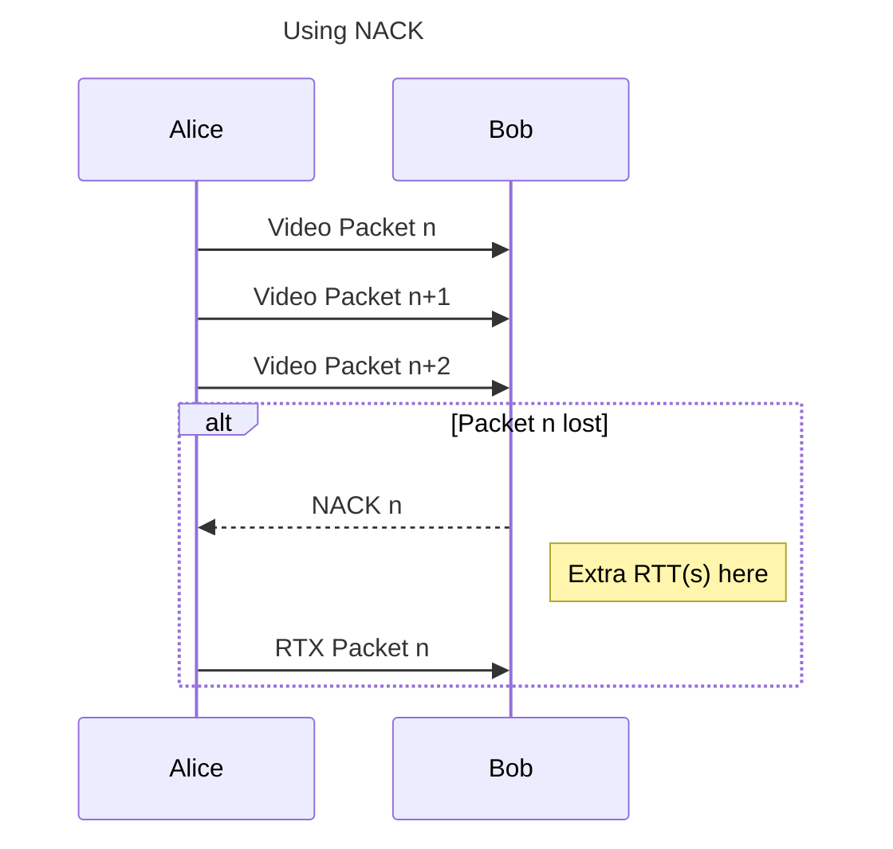
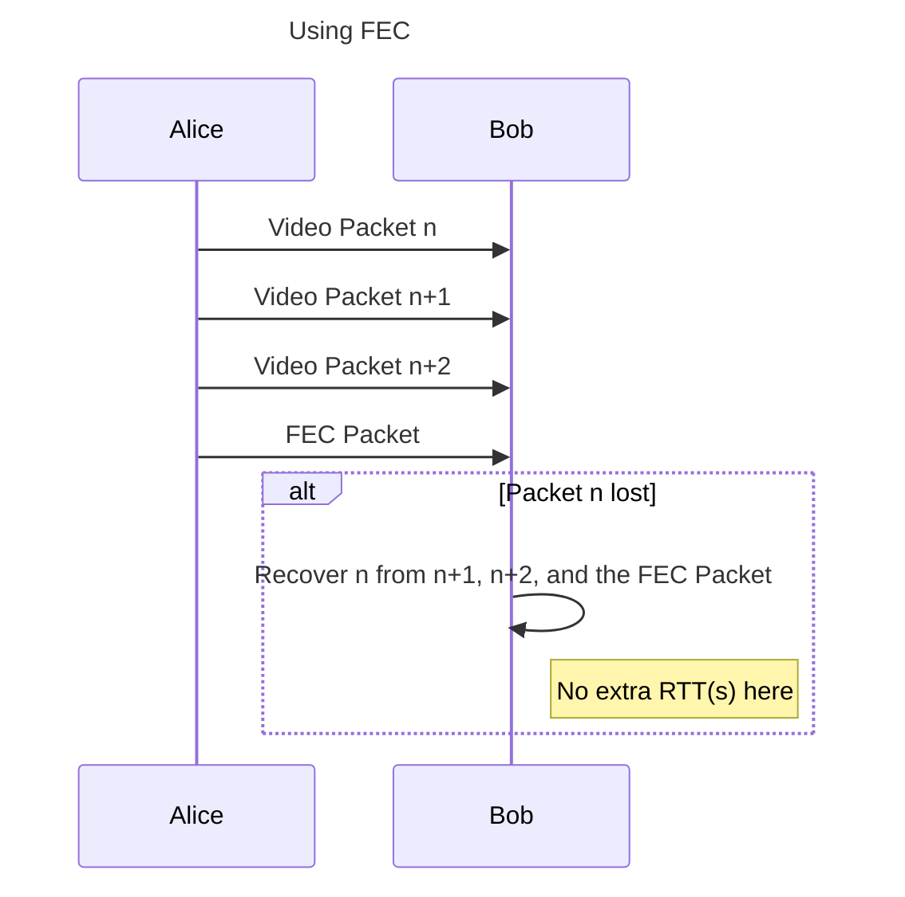

We are excited to have FEC encoding support available in the upcoming Pion v4.1.2 + pion/interceptor v0.1.38. In this blog post, you can learn about FEC and how to use it with Pion.

> If you already know FEC, feel free to skip to [FlexFEC in Pion](#flexfec-in-pion).

## Quick background: What is FEC?

Forward Error Correction (FEC) is a proactive loss-recovery mechanism that can be used to recover lost packets.

Along with each block of media packets, You intentionally transmit extra mathematically derived parity packets (e.g. xor of the media packets). If the reciver later discovers that one or even more packets are lost, it can use the parity packets to recover the lost packets, all without waiting for the lost packets to be retransmitted.

## We Already Have NACK, Why FEC?

Alice is sending a video stream to Bob with WebRTC. In an imaginary perfect network condition in which no packet loss happens and the network delay is 0 ms, all Alice needs to do is encode the video, pack RTP packets, and send them to Bob. What Bob needs to do is simply depacketize RTP packets and decode the payload into video frames. Everything is great except this imaginary perfect network condition doesn't exist.



Let's gradually introduce more factors into our network, to make it closer and closer to the real internet we live in. First, let's add packet loss while keep network delay still at 0 ms. With packet loss, not every packet Alice sends is guaranteed to be received by Bob. So we need a mechanism to recover these lost packets. A straight forward approach is to make Alice resend the lost packets again. In order to notify Alice which packet is lost and needs to be retransmitted, Bob should explicitly send message to Alice, containing the sequence number of lost packets. This is NACK. With NACK in our lossy but no-delay network, all packets can be retransmitted immediately after Bob requests NACK. Problem solved? In this case, yes. But in the real world, no.



Next, we are also adding delays to our imaginary network. At this point, it basically has all the characteristics of real world networks. Can our current mechanism tackle network delay + loss without hurting transportation quality? Sadly, no. If Alice packs a frame into 10 packets, Bob can't decode the frame even if only 1 packet is lost. And since NACK takes at least 1 additional RTT(more than 1 when retransmitted packets are lost too), this frame is delayed on Bob's side. To make things even worse, in modern video codecs, in order to increase compression ratio, encoders use a techology called **forward prediction** which means subsequent frames relies on the data of previous frame to decode. For any frame delayed due to network loss, all subsequent non-key frames will be delayed. This can cause noticeable jank for Bob, which is bad.



FEC is a mechanism that can mitigate this. FEC stands for **Forward Error Correction**. Basically, it means that we can send more data to prevent possible future losses. With FEC enabled, Alice does not only send 10 video packets to Bob, but also a few redundant packets, containing data xored from video packets. When packets get lost during transmission, Bob can try to recover it with redundant data from FEC packets. In this case, no additional RTT is needed to recover packets lost, so video streaming is not affected.

## Recovery principle

### Sender side

The sender transmits both media packets (original data) and FEC packets (redundant data):


Media packets are grouped for protection:

- Group 1: M1, M3, M5 protected by F1
- Group 2: M2, M4 protected by F2

### Receiver side

During the transmission, some media packets are lost:


Received FEC packets are used to reconstruct missing data:

- F1 recover any lost packet from Group 1
- F2 recover any lost packet from Group 2

## FEC Mechanisms in WebRTC

In WebRTC there are two main RTP based forward-error-correction (FEC) mechanisms. They both generate XOR parity packets, but the way they're signalled and routed is very different:

| Feature | **FlexFEC ([RFC 8627](https://datatracker.ietf.org/doc/rfc8627/))** | **ULPFEC + RED ([RFC 5109](https://datatracker.ietf.org/doc/rfc5109/))** |
| ---- | ---- | ---- |
| **Transport** | Travels on its own SSRC and payload-type, SDP advertises an extra repair m-section and an `a=ssrc-group:FEC-FR <media-ssrc> <fec-ssrc>` line. | Parity bytes are wrapped inside a RED packet that uses the same SSRC as the media. No extra m-section needed; you just add a RED and a ULPFEC payload-type. |
| **Codecs** | True **Codec-agnostic**, works with VP8/9, H.264, AV1 … anything that produces RTP packets. | While **codec-agnostic** in theory, Chromium limits full protection to VPx and AV1. With H264 and H265 the encoder can't flag per-partition loss importance in a way that is useful for FEC. ULPFEC + Nack for codecs without Picture-ID will have to retransmit FEC packets, So ULPFEC is not used for H264 and H265. |
| **Loss patterns handled** | Two-dimensional (rows × columns) parity | Single-direction parity |
| **Implementation status** | All Chromium-based browsers can *receive* FlexFEC; **send-side** support is still immature. Limited receive support in Safari and Firefox doesn't support it. | **Send + Receive** in Chrome, Firefox, Safari. |

FlexFEC is the only option that remains fully codec-agnostic. ULPFEC does a fine job for VP8/VP9/AV1, but offers little benefit for H264 or H265.

### Codec-integrated FEC 

While FlexFEC and ULPFEC live at the RTP packet layer, some codecs integrate redundancy straight into the encoded payload itself.

The only such codec you'll meet in browsers today is Opus, And the way it works is when you set `useinbandfec=1`, the Opus encoder embeds a low-bit-rate redundancy (LBRR) copy of frame N-1 inside the packet that carries frame N. If packet N-1 is lost, the decoder can reconstruct it from the tail of N.

## FEC isn't magic: trade-offs to keep in mind

1. **Bandwidth overhead**
   Redundancy steals bandwidth from the link. If you add 20% FEC without raising the send cap, You must drop video resolution or audio quality to make room.

2. **Congestion-control back-pressure**
   Congestion control algorithms count FEC bytes as real media. If the connection is already near capacity, enabling FEC can trip congestion control and lower the overall bitrate.

3. **Mismatch with loss pattern**
   Random 1-2% loss is where light FEC shines. But for example, 10% bursts every few hundred ms requires high parity, which is often end up worse than just using RTX.

4. **Sometimes it's silent failures**
   It's hard for analytics to tell whether a recovered frame was actually recovered, you might assume FEC saved the day while users are actually seeing glitches or artifacts.

5. **Redundancy is not reliability**
   FEC only copes with *packet* loss. If the network pauses for 500 ms, every parity packet in that interval is lost too. For long drops you still need buffering, retransmission, or a fallback layer.

> Tip: Enable the cheapest protection first (Opus in-band FEC for audio, RTX for video). Add ULPFEC or FlexFEC only when telemetry shows sustained loss or when you have bandwidth room. Treat FEC as a dynamic option, not a set-and-forget checkbox.

## FEC Algorithms in WebRTC

FlexFEC and ULPFEC both use XOR-based recovery logic to generate packets. Another family of algorithms, like [Reed-Solomon](https://en.wikipedia.org/wiki/Reed%E2%80%93Solomon_error_correction), can recover from more complex losses but are currently too computationally expensive for real-time use in WebRTC.

If you're curious, the [klauspost/reedsolomon Go library](https://github.com/klauspost/reedsolomon) offers a SIMD-accelerated implementation that's fun to experiment with.

## FlexFEC in Pion

Pion now supports basic FlexFEC encoding! You can pair it with Chromium and Safari (receive-only), and it's simple to integrate; just register the payload type in your media engine and add the interceptor. Then you're good to go!

For a quick demo, you can check out the [play-from-disk-fec](https://github.com/pion/webrtc/tree/master/examples/play-from-disk-fec) example.

### What To look forward to in the final FlexFEC implementation

If you worked with FlexFEC, you may come across multiple draft versions, **FlexFEC-03** and **FlexFEC-20**. The final standard is published as [RFC 8627](https://datatracker.ietf.org/doc/rfc8627/), and while it builds on ideas introduced in the -20 draft, it formalizes several features and adds important clarifications.

Although Pion doesn't yet fully support RFC 8627, we're tracking it closely and excited about the improvements it will bring, here are some of the highlights:

1. **Flexible Masking (Selective Protection)**:
   RFC 8627 introduces a **flexible mask** mode, allowing senders to protect an arbitrary subset of source packets. Instead of a fixed pattern, it sends a bitmask indicating exactly which packets are covered. This can be used to implement smarter FEC strategies, such as protecting only keyframes or higher-priority codec configuration packets.
   -> [RFC 8627, Section 1.1.4](https://datatracker.ietf.org/doc/rfc8627/#section-1.1.4)

2. **Hybrid FEC and Retransmission Support**
   The final spec explicitly supports both **proactive FEC** and **RTP retransmission**. It also requires that when FlexFEC is used alongside another retransmission mechanism, the answer in an SDP negotiation must use FlexFEC only, ensuring consistent protection handling.
   -> [RFC 8627, Section 1.1.7](https://datatracker.ietf.org/doc/rfc8627/#section-1.1.7)

3. **Improved Scalability and Consistency**
   RFC 8627 addresses scalability limitations from earlier FEC mechanisms like [RFC 5109](https://datatracker.ietf.org/doc/html/rfc5109) and [RFC 2733](https://datatracker.ietf.org/doc/html/rfc2733). It also reuses the **RTP repair stream format** defined in [RFC 6363](https://datatracker.ietf.org/doc/html/rfc6363), making it more consistent with modern RTP practices and easier to interoperate with existing tooling.
   -> [RFC 8627, Section 1.1.1](https://datatracker.ietf.org/doc/rfc8627/#section-1.1.1)

4. **Packet and Header Format Clarifications**
   The final spec clearly defines key header fields. For example, the **R bit** distinguishes retransmission (R=1) from FEC repair (R=0), while the **F bit** selects between flexible-mask mode (F=0) and fixed-offset mode (F=1). These explicit semantics simplify implementation logic and parsing.
   -> [RFC 8627, Section 6.2](https://datatracker.ietf.org/doc/rfc8627/#section-6.2)

### Enable FlexFEC Encoding in Pion

You can use the helper for quick setup:

```go
err = webrtc.ConfigureFlexFEC03(fecPayloadType, mediaEngine, interceptorRegistry)
```

Or setup codec and interceptor by hand:

1. Register FlexFEC03 codec to MediaEngine

```go
err = m.RegisterCodec(
    webrtc.RTPCodecParameters{
        RTPCodecCapability: webrtc.RTPCodecCapability{
            MimeType:     webrtc.MimeTypeFlexFEC03,
            ClockRate:    90000,
            Channels:     0,
            SDPFmtpLine:  "repair-window=10000000",
            RTCPFeedback: nil,
        },
        PayloadType: 118, // You can change this
    },
    webrtc.RTPCodecTypeVideo,
)
```

2. Register FlexFEC interceptor

```go
fecInterceptor, err := flexfec.NewFecInterceptor()
// handle error...
i.Add(fecInterceptor)
```

That's it! But with a few catches:
1. The order of the FlexFEC interceptor in the chain of interceptors matters. It should be registered before TWCC header extension interceptor and NACK responder interceptor if you are using these.
2. If you are using congestion controller, be aware of the bandwidth FEC is taking, you should set your encoder's bitrate to `cc_estimated_bandwidth - fec_bitrate`. By default, out of 5 media packets, 2 FEC packets will be produced, so expect roughly 40% bitrate overhead. You can tune FEC paramters to reduce or increase it.
3. Enabling FlexFEC encoding may introduce significant CPU/RAM overhead.
4. Current implementation does not protect media packet batch if it contains missing or reordered packets. So it works best with senders which packetize media themselves.

### Configuring FlexFEC Encoder Interceptor

You can customize FEC protection by tweaking `NumMediaPackets` and `NumFECPacket` using the interceptor's [options](https://github.com/pion/interceptor/blob/master/pkg/flexfec/option.go).

It will result in a protection profile which uses `NumFECPackets` FEC packets to protect each `NumMediaPackets` media packets. Interleaved protection will be used, which means that media packet `X` will be protected by FEC packet `(X mod NumFECPackets)`.

### Verify that FlexFEC is Enabled

- On sender side, which is within Pion, you can log the packets using the [packetdump interceptor](https://github.com/pion/interceptor/tree/master/pkg/packetdump).
- On receiver side, for example, in Chromium, you can go to `chrome://webrtc-internals` and search for the stats graph of fecBytesReceived.

## Credits

Huge thanks to everyone who contributed to this project: [Aleksandr Alekseev](https://github.com/aalekseevx/), [Jingyang Kang](https://github.com/3DRX/), [Joe Turki](https://github.com/JoeTurki), [Sean DuBois](https://github.com/Sean-Der), [Thomas Pouget-Abadie](https://github.com/pougetat).
