## What is SCTP?

SCTP stands for Stream Control Transmission Protocol. At a basic level, SCTP is designed to be reliable, handle de-duplication of packets, and support packets that may be delivered in order or out of order. Beyond transporting messages, SCTP can also set up a connection between users. On a deeper level, SCTP includes native support for multiplexing: multiple applications can take advantage of a single transport connection. SCTP also supports multi-homing, which enables automatic failover from a primary connection to a secondary one.

At the most basic level, it lets you reliably send information from one computer to another without any complications.

### What is SCTP used for?

SCTP's uses can generally fit into two cases:

#### 1. Sending some amount of data.

Imagine a scenario where two people are texting when one person remembers a picture that they want to send. As they text back and forth, an image gets uploaded, which takes some time to get sent. SCTP can handle multiple things going on at the same time and doesn't delay any messages from being sent just because an image is being uploaded! Thanks to SCTP, text messages can be safely delivered to each person and nothing in their conversation is lost in transit or delayed just because something else is being transferred at the same time as their messages.

Building on this idea, users can share larger files with each other. This includes anything: birthday videos, audio recordings, even boring paperwork; anything that's a file can be sent!

#### 2. Sending small amounts of data with a purpose.

In a new scenario, imagine two people who are texting back and forth when one person gets hungry. They send a message saying, "I want a pizza!" When the other person receives the text, they think, "Maybe I should do something about that!" The recipient can choose to do something useful for the sender with that information.

This is the blueprint for many awesome technologies today, as it opens up the possibility of controlling one computer from a different computer. Consider a surgeon who performs an operation involving a remote-controlled device that needs to respond with as little latency as possible. Similarly, real-time navigation systems also need to respond to changes in traffic conditions quickly in order to avoid congested or unsafe areas due to accidents or weather conditions.

#### Other uses:

SCTP can be used for online multiplayer games where every frame counts, including first-person shooters and fighting games. Taking the remote surgery example in this direction leads to the idea of cloud gaming, as players can have their inputs sent to a different device than the one that they're using while still being able to play the game!

SCTP is also used inside web browsers via WebRTC and has found use in AI applications and cryptocurrency-related technologies. Additionally, payment verification can similarly benefit from secure and fast communication.

## Why SCTP for WebRTC?

SCTP is used for WebRTC because of its ability to send information via reliable and unreliable datachannels. For example, you can send messages or files in a chat with SCTP. Other uses include being able to know when users toggle their microphone or video in a video call. In some special cases, SCTP can even be used to transmit video between users, but that's significantly less common.

In WebRTC, the ICE protocol connects users and the DTLS protocol establishes a secure connection, at which point SCTP is then used to securely transfer data. In an ideal setup, data that's sent should "just work". Unfortunately, that isn't how things tend to pan out, as issues eventually crop up. Packets get dropped, the network jitters, the computer stutters, or the coffee machine doesn't start when you thought it had. That's why it's important to have a backup plan for when things go wrong.

## How SCTP Deals With Loss

SCTP was designed with this in mind and has two built-in recovery strategies for when networking goes wrong.

The first is called "fast retransmission." The receiver detects if a chunk of data is missing in the transmission. If so, the receiver notifies the sender that a specific chunk ID is missing. If the sender receives three reports of a missing chunk where all three reports are referring to the same chunk ID, then the sender will assume that the chunk has been lost and resend it.

The second is a timer-based retransmission. This happens if the receiver doesn't acknowledge that it has received all the packets within a specific window of time. If the receiver doesn't acknowledge that all the packets have been received, then the sender is prompted to retransmit the unacknowledged data.

Both of these loss recovery strategies are used by SCTP to try to ensure that any lost data is detected and retransmitted as quickly as possible. At the time of writing, Pion's implementation of [Pion's implementation of SCTP](https://github.com/pion/sctp/tree/b1a66a4) uses these two mechanisms for loss recovery.

These strategies are also used by TCP, which has prompted engineers to see if there's an even better strategy to detect and mitigate lost data.

## Introducing RACK

In February 2021, [RFC 8985: The RACK-TLP Loss Detection Algorithm for TCP](https://www.rfc-editor.org/rfc/rfc8985.html) was published. This was a completely new loss detection algorithm that focused on actively keeping track of network statistics and using timer-based signals in order to remain adaptive to ever-changing network conditions. RACK's improvements over SACK and fast retransmission in TCP were enticing enough for Linux, Windows, and FreeBSD to all implement it in TCP.

While RACK was originally intended to be implemented for TCP, it is [noted in the RFC that it can be implemented in other transport protocols](https://www.rfc-editor.org/rfc/rfc8985.html#section-9.5), including SCTP.

The implementation for SCTP was formally analyzed in [Felix Weinrank's Dissertation](https://duepublico2.uni-due.de/servlets/MCRFileNodeServlet/duepublico_derivate_00073893/Diss_Weinrank.pdf) and other publications. Weinrank's deep dive provides an extremely comprehensive review of SCTP and improvements regarding usage in various scenarios, including WebRTC. At the moment, we're more concerned with Weinrank's analysis and implementation notes regarding RACK in SCTP. In [Chapter 7 of the dissertation](https://duepublico2.uni-due.de/servlets/MCRFileNodeServlet/duepublico_derivate_00073893/Diss_Weinrank.pdf#chapter.192), Weinrank goes over how SCTP handles loss and how RACK can be implemented for SCTP, including extra details regarding how the implementation interacts with various SCTP extensions.

## RACK's motivations:

The authors of RACK in [RFC 8985](https://www.rfc-editor.org/rfc/rfc8985.html) provides examples of situations where RACK improves SCTP and TCP during loss recovery.

### How RACK's Tail Loss Probing (TLP) Works

```mermaid
sequenceDiagram
    participant S as Sender
    participant R as Receiver

    Note over S,R: The two sends are normally<br>combined but are separated<br>here for visual clarity.
    S->>R: Send 🍎
    S-->>R: Send 🍌, 🥕, 🥔
    Note right of R: Only 🍎 arrived, so it's ACK'd.
    R->>S: ACK 🍎

    Note over S,R: 2 RTTs later, TLP fires
    S->>R: TLP triggers a retransmit 🥔
    Note right of R: 🥔 arrived, so it's SACK'd.
    R->>S: SACK 🥔

    Note left of S: Mark 🍌 and 🥕 as lost
    Note over S,R: The two sends are normally<br>combined but are separated<br>here for visual clarity.
    S-->>R: Retransmit 🍌
    S->>R: Retransmit 🥕
    Note right of R: Only 🥕 arrived, so it's SACK'd<br>alongside 🥔.
    R-->>S: SACK 🥕 and 🥔

    Note left of S: 🍌 retransmission marked as lost.<br>Note that this is the second time<br/>that 🍌 has been marked as lost.
    S->>R: Retransmit 🍌 again
    Note right of R: 🍌 finally arrived!
    R-->>S: ACK 🥔
    Note over S,R: The ACK 🥔 is a cumulative ACK<br>for the 🍎🍌🥕🥔 sequence
```

In the above scenario, Tail Loss Probing enables the sender to quickly know if 🍎🍌🥕🥔 were successfully received. Since the sender only receives an acknowledgment (ACK) for 🍎 from the receiver, the TLP timer eventually triggers because it didn't receive an ACK for 🍌, 🥕, and 🥔. The TLP can then resend the last packet in the segment as an efficient way to:

1) Retransmit data that the receiver would have to receive down the line anyway. The alternative would be to send an empty packet, receive an ACK, then send a missing packet. This handles both at once and can potentially save an RTT if *only* the last packet is missing in a segment.

2) Allow the receiver to ACK any earlier missing packets in the sequence if there were other issues due to networking, temporary stutters or freezes, etc.

3) Check receiver responsiveness and detect if there's a network issue. Note that this is different from (2), as the receiver could potentially never respond with an ACK.

The receiver then confirms that it has 🥔 by sending a selective acknowledgment (SACK) to the sender, which tells the sender that it's received one of the packets from the segment but not all of them. At this point, the sender has an ACK for 🍎 and a SACK for 🥔, which means that it can determine that 🍌 and 🥕 must be missing. The sender then notes that 🍌 and 🥕 have been lost once. It then retransmits 🍌 and 🥕. In the example, 🍌 happens to get dropped by the network whereas 🥕 is sent and received successfully. The receiver then replies with a SACK for 🥕 and 🥔, at which point the sender can determine that 🍌 was lost a second time. Finally, the sender retransmits 🍌, which fortunately doesn't get dropped, and the receiver sends an ACK for 🥔 (note the ACK is for the last packet in the segment, which implies that all previous packets have been received).

Side note: keeping track of the number of times that a packet has been lost is important as the cubic congestion control algorithm described in [RFC 9438](https://datatracker.ietf.org/doc/rfc9438/) (which is mentioned in RFC 8985) relies on this information.

### SCTP RTO vs RACK RTO

In this example, the authors of [RFC 8985](https://www.rfc-editor.org/rfc/rfc8985.html) show how, without RACK, SCTP and TCP can suffer from spurious retransmissions when there are retransmission timeouts (RTOs). In this case, each food icon represents an entire segment instead of a packet.

In this scenario, 🥐 is sent, and right before the end of the RTO, 🍳 and 🥭 are sent. The receiver gets 🥐, 🍳, and 🥭, but only manages to send an ACK for 🥐 right after the RTO. Let's see how SCTP handles this without RACK versus with RACK.

```mermaid
sequenceDiagram
    participant S as Sender
    participant R as Receiver

    S->>R: Send 🥐
    Note over S,R: Then right before<br>the end of the RTO...
    Note right of R: The receiver has a network hiccup!
    S->>R: Send 🍳🥭

    Note right of R: Received 🥐
    Note over S,R: End of the RTO
    R->>S: ACK 🥐

    Note over S,R: Without RACK...

    %% without rack
    Note left of S: Mark 🥐🍳🥭 as lost<br>since RTO expired

    Note right of R: Received 🍳🥭
    Note over S,R: The Sender incorrectly<br>ignores the ack for 🍳🥭!

    Note left of S: Prepare to retransmit 🥐🍳🥭
    S->>R: Retransmit 🥐🍳🥭
```

We can see here that the receiver eventually sends an ACK for 🍳 and 🥭, but the sender ignores it and believes that 🥐, 🍳, and 🥭 are all missing instead of just 🥐. While it's reasonable to assume that 🥐 is missing, it's a little overzealous in retransmitting packets, which can increase network traffic during recovery, especially when it's completely possible for the sender to wait for the acknowledgments of 🍳 and 🥭 from the receiver.

Let's see what RACK does!

```mermaid
sequenceDiagram
    participant S as Sender
    participant R as Receiver

    S->>R: Send 🥐
    Note over S,R: Then right before<br>the end of the RTO...
    Note right of R: The receiver has a network hiccup!
    S->>R: Send 🍳🥭

    Note right of R: Received 🥐
    Note over S,R: End of the RTO
    R->>S: ACK 🥐
    Note over S,R: With RACK...

    %% with rack
    Note left of S: Mark 🥐 as lost<br>since RTO expired

    Note right of R: Received 🍳🥭

    Note left of S: Prepare to retransmit 🥐
    S->>R: Retransmit 🥐
```

Here, RACK makes it so only 🥐 is marked as lost when the RTO expires. 🍳 and 🥭 aren't marked as lost because their own RTOs have not yet expired by the time their ACKs are received. Therefore, only 🥐 is retransmitted, as the timers for 🍳 and 🥭 would be re-armed if an ACK is received for the retransmitted 🥐.

In this example, even though both non-RACK and RACK end up retransmitting 🥐 despite the receiver already having it, the focus is on minimizing spurious retransmissions. This can save on the amount of data sent over the network, which naturally speeds up any retransmissions that might occur.

### RACK's strategy

In summary, RACK's strategy generally has two main parts:

1. Detect packet losses as quickly as possible by utilizing time-based acknowledgments of segmented data and inferences from network statistics.

2. Use Tail Loss Probing (TLP), which sends sample data to gather more network statistics.

The combination of these two strategies allows it to quickly determine issues and properly rectify them once identified. It also provides better resilience for some tricky edge cases! If you're interested in seeing how RACK could perform in SCTP and other SCTP-specific improvements, check out [chapter 7 of Felix Weinrank's thesis](https://duepublico2.uni-due.de/servlets/MCRFileNodeServlet/duepublico_derivate_00073893/Diss_Weinrank.pdf#chapter.192).

## A quick look at the results

As fun as it is to learn about what RACK does, it's also a lot of fun to see how it performs in the real world with actual applications.

Fortunately for us, we received [explain the data] that lets us test and benchmark how SCTP performs before and after RACK! We were even able to capture performance from an SCTP connection *without* RACK against one *with* RACK.

[M-M]

We can see our control case of two SCTP connections from our main branch which doesn't have RACK implemented yet. Next up, we can introduce a connection that *has* RACK implemented.

[M-R]

Here we have one side that's our implementation from the main branch, and the other side which uses RACK. The side with RACK has sees a benefit of x% in most cases without any network anomalies, and y% with z loss. With [packet stuff] we see [blah blah blah].

[R-R]

Finally we get the improvement that everyone who uses the newest version will see just by updating their Pion libraries! Between two connections that have RACK, we see an average performance increase of x% in the above tests, with the largest gain being y% in [testcase name goes here]. If we take a look at the memory and cpu tradeoff, we can see that [abcdefg]: a slightly higher CPU cost that's well worth the uplift in performance.

### A sneak peek into the new year

As we move into the new year, we're grateful for everyone who has helped to contribute to Pion's 4.2 WebRTC release as countless folks fixed things across all the different libraries that make WebRTC possible in the first place.

The new year holds new improvements, features, and of course more bugs! Nothing could be a better present than a sneak peek into even some improvements that have been in the works ever since RACK was added:

[M-A]
[R-A]
[A-A]

The gains from [A-A] are live in Pion's 4.2 WebRTC release! The other benchmarks are not final and are subject to change.

Keep an eye out for even more improvements and benchmarks from our improved SCTP implementation using real-world data, as well as how we're doing it in an upcoming blog post!

Thanks for reading!

## Credits

Huge thanks to the following for making this possible:
- [Joe Turki](https://github.com/JoeTurki) for introducing me to Pion, making SCP, answering countless questions, and so much more.
- [Sean DuBois](https://github.com/Sean-Der) for making Pion, finding [Felix Weinrank's thesis](https://duepublico2.uni-due.de/servlets/MCRFileNodeServlet/duepublico_derivate_00073893/Diss_Weinrank.pdf), and endless encouragement.
- [Srayan Jana](https://github.com/ValorZard) for helping to bounce around many ideas.
- [Atsushi Watanabe](https://github.com/at-wat) for reviewing and catching an important bug in the RACK PR (it's fixed now).
- And many more people along the way!