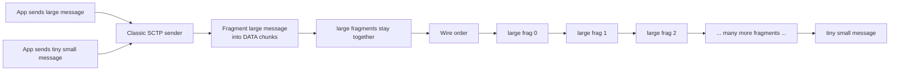

## What is head-of-line blocking and why it's an issue with WebRTC datachannels

SCTP (the protocol used by WebRTC data channels) looks like it should be perfect for multiplexed application data. It is message-based, it supports multiple streams inside one association, and WebRTC data channels are built on top of it for non-media data.

To understand sender-side head-of-line blocking, we first need to understand how SCTP sends messages. Messages are scheduled based on their send order. SCTP fragments messages according to the path MTU (Maximum Transmission Unit), which is usually around 1200 bytes for WebRTC. A 256 KB message would therefore be split into roughly 218 smaller fragments (chunks).



### So what is the actual problem?

Imagine you're streaming media over SCTP for some special use case, maybe DRM protected-content or codecs that aren't normally supported by WebRTC media tracks (RTP), such as AAC audio or VVC video. At the same time you have control, telemetry or chat streams sharing the same SCTP association.

If a media stream starts sending large reliable messages, SCTP will fragment them into smaller chunks, and those fragments can monopolize the send queue. In other words, small chat or control messages may end up waiting behind the large transfer.

If the stream is reliable and packets are lost, retransmissions of those large fragments can delay smaller streams even further. Chat messages will look delayed, and control traffic will feel laggy.


```text
large video fragment 0
large video fragment 1
large video fragment 2
large video fragment 3
...
large video fragment 200
tiny control message finally sent
chat messages finally sent
audio-like frame finally sent
```

### So why can't I just fragment the messages myself and have my own queue?

Many applications do exactly that to avoid large SCTP messages, instead of sending one huge message, the application splits it into smaller chunks (just like SCTP itself), and schedules those chunks itself.

But the tradeoff is that you're now effectively building another protocol on top of SCTP.

And you need to handle things like chunk numbering, reassembly, flow control, backpressure handling, retransmission semantics, fair scheduling, and message boundaries.

This gets trickier depending on the stream mode (pick your poison).

If you use partially reliable streams or unreliable streams (SCTP won't retransmit lost packets), you need to decide what happens when fragments are dropped, should it be discarded, partially decoded, retransmitted, some sort of [FEC](https://pion.ly/blog/fec-with-pion/)?


But if you decide you're not going to deal with a complex unreliable handling, and you use reliable streams, then you're back dealing with delayed delivery on other streams under packet loss and retransmissions on bad networks.

[RFC 8260](https://www.rfc-editor.org/rfc/rfc8260.html) was written to fix exactly this class of problem. The issue was that TSN (Transmission Sequence Number), was doing too many jobs at once: reliability, fragment reassembly, and sequencing. fragmented messages also had to use consecutive TSNs.

## What I-DATA changes

SCTP message interleaving uses the **I-DATA** chunk. The important change is that TSN is no longer used to order fragments inside a user message. I-DATA adds:

```text
MID = Message Identifier
FSN = Fragment Sequence Number
```

The *TSN still exists*, though. It is still used for reliability, SACKs (Selective Acknowledgment), loss detection, and retransmission. But fragment reassembly now uses **MID + FSN**, not "all fragments must be adjacent in TSN space." RFC 8260 says I-DATA adds MID and FSN, removes SSN, uses MID to identify the message, and uses FSN to enumerate fragments of that message.

So the identity becomes:

```text
TSN = reliability / SACK / retransmission
SID = SCTP stream
MID = user message inside that stream
FSN = fragment number inside that message
```

Example:

```text
SID=4 MID=90 FSN=0 TSN=100  video fragment
SID=2 MID=301 FSN=0 TSN=101 chat message
SID=0 MID=12 FSN=0 TSN=102 control message
SID=4 MID=90 FSN=1 TSN=103 video fragment
SID=1 MID=44 FSN=0 TSN=104 chat message
SID=4 MID=90 FSN=2 TSN=105 video/ fragment
```

The video fragments still reassemble correctly because the fragments are identified by:

```text
SID=4 + MID=90 + FSN=0,1,2,...
```

They no longer need to occupy one contiguous TSN range :)

## Interleaving under loss

Interleaving does not make packet loss disappear. It does not give every stream its own congestion window. It does not magically create bandwidth, It just lets other streams compete for send opportunities between fragments of a large message.

With interleaving, a bad network can still look like this:

```text
bulk fragment sent
audio-like frame sent
control message sent
bulk fragment sent
telemetry sent
bulk fragment lost
audio-like frame sent
retransmit lost bulk fragment
control message sent
```

That is much better than:

```text
bulk fragment sent
bulk fragment sent
bulk fragment lost
bulk fragment sent
bulk fragment sent
retransmit lost bulk fragment
control finally sent
audio-like frame finally sent
telemetry finally sent
```

The retransmission still costs capacity, but it no longer has to trap every other stream behind the large message’s original serialization.

## Where "Stream Schedulers" fit in the title

Interleaving gives SCTP the ability to pick chunks from different streams. But it still needs a policy for deciding which stream goes next.

Common policies are:

```text
round-robin:
  each non-empty stream gets turns

priority:
  high-priority streams are served before lower-priority streams

WFQ:
  weighted fair queuing; streams receive capacity according to weights
```

RFC 8260 defines SCTP stream schedulers, including round-robin, priority, and weighted fair queuing. It says WFQ uses configurable per-stream weights and that, if one stream has n times another stream's weight, it should receive n times the capacity. It also says WFQ with user-message interleaving is used for WebRTC data channels.

For HOL-sensitive apps, this is the powerful combination:

```text
I-DATA interleaving + WFQ or priority scheduling
```

Interleaving breaks the large-message wall. WFQ or priority decides who gets protected.

Pion/SCTP implementation for RFC 8260 comes with WFQ scheduler (default), WFQ with custom weight so you can prioritize a specific stream (`func WithInterleavingWeightedFairqueuingWeight(streamID uint16, weight uint16)`), and round robin scheduler (enabled via `WithInterleavingRoundRobinScheduler()`).

and if you feel like it you can even define your own custom scheduler :)

```go
type InterleavingStreamScheduler interface {
	Reset()
	Push(StreamSchedulerChunk)
	Peek() StreamSchedulerChunk
	Pop(StreamSchedulerChunk) error
}

func WithInterleavingStreamSchedulerFactory(newScheduler InterleavingStreamSchedulerFactory)
```

## The interleaving-inspection example

I added [an example](https://github.com/pion/webrtc/tree/main/examples/sctp-interleaving-inspect) to pion that lets you inspect and play with interleaving, it has a basic pressure test, if you have interleaving enabled, you'll see something like this (notice all control messages arrive before bulk chunks complete)


if you don't have interleaving enabled, you'll see something like this (notice how control messages had to wait for bulk chunks to complete):


## So how can I enable and use interleaving?

Interleaving should be enabled by default in Pion 4.2.13 and above, and there is nothing you need to do.

As I wrote this, interleaving is enabled by default in Firefox, and is behind a flag in Chrome, and [merged to Pion/sctp](https://github.com/pion/sctp/pull/443).

Interleaving isn't actually used unless it's supported by the other side, and negotiated during the handshake. To know if a current stream has interleaving or not, we expose it through Pion's GetStats()

```go
report := pc.GetStats()

for _, stat := range report {
    sctpStats, ok := stat.(webrtc.SCTPTransportStats)
    if !ok || sctpStats.Metadata == nil {
        continue
    }

    fmt.Println("SCTP interleaving:", sctpStats.Metadata.MessageInterleavingEnabled)
    fmt.Println("Partial reliability:", sctpStats.Metadata.PartialReliabilityMode)
}
```

The stats metadata includes:

```json
{
  "metadata": {
    "messageInterleavingEnabled": true,
    "partialReliabilityMode": "i-forward-tsn",
    "zeroChecksumSendingEnabled": true,
    "zeroChecksumReceivingEnabled": true
  }
}
```

We might have similar stats in the browser API if W3C accepts [my issue](https://github.com/w3c/webrtc-stats/issues/821).

## Thanks

Huge thanks to:

* [Sean DuBois](https://github.com/Sean-Der) For introducing me to this spec, I saw him talking about it a few years ago, and for making and inviting me to Pion :)
* [R Chiu](https://github.com/philipch07/) For making pion/sctp fun again. We hope to see her again in Pion.
* [Nils Ohlmeier](https://github.com/nils-ohlmeier) For helping me navigate I-DATA support in Firefox, even tho I ghosted him for a bit after I got a new job :)
* [Valor Zard](https://github.com/ValorZard) For making a list of all the libraries that supports RFC-8260 while I was doing interop tests, and for consistently and inderiectly reminding me to finish Pion's RFC-8260 implementation.
* [Philipp Hancke](https://github.com/fippo) for helping me trying to get [interleaving as a transport stats to w3c](https://github.com/w3c/webrtc-stats/issues/821)
* [Júlia Paschoalinoto](https://github.com/juliapixel/) and [Franta](https://github.com/frantabot) for all the manual testing and feedback.
